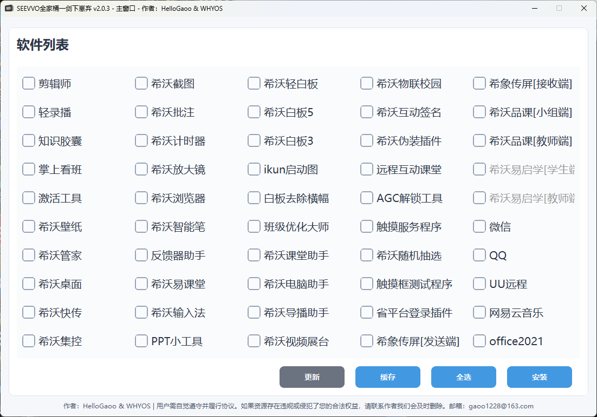
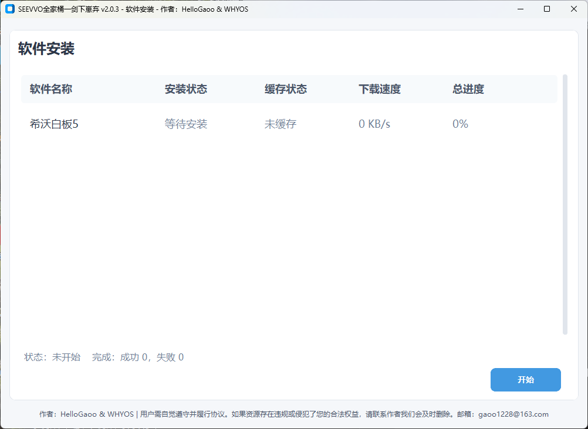
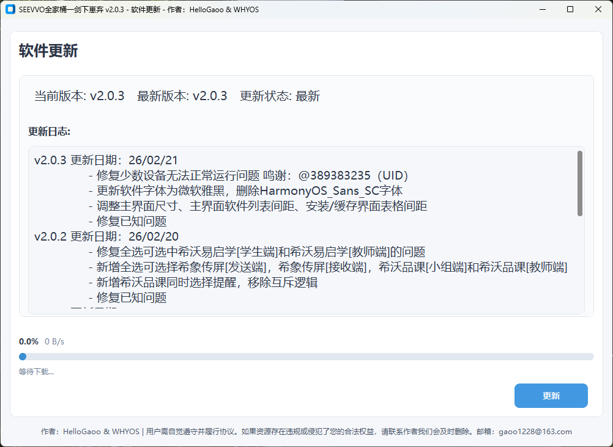

<div align="center">
  
  <h1 style="display: inline-block; vertical-align: middle;">SEEVVO全家桶一剑下崽弃</h1>
  <p style="font-size: 24px; font-weight: bold;">SeevvoDownloader</p>
  
  <div style="margin: 15px 0;">
    <a href="https://github.com/HelloGaoo/SeevvoDownloader/stargazers"></a>
    <a href="https://github.com/HelloGaoo/SeevvoDownloader/tags"></a>
    <a href="https://github.com/HelloGaoo/SeevvoDownloader/releases"></a>
    <a href="https://www.bilibili.com/video/BV1b2fmBYEbY" target="_blank"></a>
  </div>
  <br>
</div>

## 项目简介

SEEVVO全家桶一剑下崽弃是一款专门为希沃相关软件打造的下载管理工具，旨在简化希沃软件的获取和安装过程。通过直观的图形界面，用户可以轻松选择并批量下载所需的希沃软件，无需逐个访问官方网站查找下载链接。

## 功能特性

- **批量下载**：支持同时选择多个软件进行下载
- **图形界面**：直观友好的操作界面，易于使用
- **进度显示**：实时显示下载进度和速度
- **自动解压**：内置7z解压功能，支持自动解压压缩包
- **缓存管理**：智能缓存机制，避免重复下载
- **日志系统**：详细的日志记录，便于排查问题
- **用户协议**：内置用户协议确认机制
- **多软件支持**：涵盖希沃全系列软件及常用工具

## 安装和使用

### 直接运行
1. **下载项目**：将项目文件拉取到本地
2. **环境要求**：确保安装了Python 3.14或更高版本
3. **安装依赖**：
   ```bash
   pip install customtkinter py7zr requests plyer
   ```
4. **运行程序**：双击运行 `SEEVVO全家桶一剑下崽弃.py` 文件

### 编译为可执行文件
如果您希望在没有Python环境的机器上运行，可以将项目编译为可执行文件：

1. **安装PyInstaller**：
   ```bash
   pip install pyinstaller
   ```

2. **执行编译命令**：
   ```bash
   pyinstaller --onefile --windowed --icon=icon/003.ico SEEVVO全家桶一剑下崽弃.py
   ```

3. **获取可执行文件**：编译完成后，可执行文件将位于 `dist` 目录中

## 项目结构

```
SeevvoDownloader/
├── Tools/            # 工具目录
│   ├── 7z.exe        # 7-Zip解压工具
│   └── aria2c.exe    # 下载工具
├── assets/           # 图片目录
│   ├── 主界面.png     # 主界面截图
│   ├── 安装界面.png   # 安装界面截图
│   ├── 更新界面.png   # 更新界面截图
│   ├── 缓存界面.png   # 缓存界面截图
│   └── 预览图.jpg     # 预览图
├── icon/             # 图标目录
│   ├── 001.ico       # 主程序图标
│   ├── 002.png       # 其他图标
│   └── 003.ico       # 其他图标
├── SEEVVO全家桶一剑下崽弃.py  # 主程序
├── version.py        # 版本信息
├── LICENSE           # 许可证文件
└── README.md         # 说明文档
```

## 界面预览

### 主界面


### 安装界面


### 更新界面


### 缓存界面

## 支持的软件

| 软件名称 | 软件名称 | 软件名称 | 软件名称 |
|----------|----------|----------|----------|
| 剪辑师 | 轻录播 | 知识胶囊 | 掌上看班 |
| 激活工具 | 希沃壁纸 | 希沃管家 | 希沃桌面 |
| 希沃快传 | 希沃集控 | 希沃截图 | 希沃批注 |
| 希沃计时器 | 希沃放大镜 | 希沃浏览器 | 希沃智能笔 |
| 反馈器助手 | 希沃易课堂 | 希沃输入法 | PPT小工具 |
| 希沃轻白板 | 希沃白板5 | 希沃白板3 | ikun启动图 |
| 白板去除横幅 | 班级优化大师 | 希沃课堂助手 | 希沃电脑助手 |
| 希沃导播助手 | 希沃视频展台 | 希沃物联校园 | 希沃互动签名 |
| 希沃伪装插件 | 远程互动课堂 | AGC解锁工具 | 触摸服务程序 |
| 希沃随机抽选 | 触摸框测试程序 | 省平台登录插件 | 希象传屏[发送端] |
| 希象传屏[接收端] | 希沃品课[小组端] | 希沃品课[教师端] | 希沃易启学[学生端] |
| 希沃易启学[教师端] | 微信 | QQ | UU远程 |
| 网易云音乐 | office2021 | | |

## 技术实现

- **开发语言**：Python 3.14
- **GUI框架**：CustomTkinter
- **下载功能**：Requests
- **解压文件**：py7zr
- **通知功能**：plyer
- **日志功能**：logging

## 许可证

本项目采用 **GNU General Public License v3.0** 许可证。

## 免责声明

- **仅供学习研究**：本工具仅用于学习和研究目的
- **非商业用途**：请勿用于商业用途
- **资源来源**：所有软件资源均来源于官方或公开渠道
- **侵权处理**：如有侵权，请联系作者删除
- **责任自负**：使用本工具产生的任何后果由用户自行承担
- **其余详情见首次运行提示的协议**

## 作者

- **HelloGaoo**
- **WHYOS**

## 联系方式

- **邮箱**：gaoo1228@163.com
- **哔哩哔哩**：[https://space.bilibili.com/1498602348](https://space.bilibili.com/1498602348)
- **QQ**：2404445436

## 贡献

欢迎提交 Issue 和 Pull Request 来帮助改进这个项目！

## 更新日志

### v2.1.0 更新日期：26/02/28
- 更新多GitHub下载源
- 更新安装完保留安装包到缓存（cache）目录的选项
- 修复已知问题

### v2.0.4 更新日期：26/02/22 鸣谢：@389383235（UID）
- 全选取消希沃输入法 希沃课堂助手 希沃电脑助手 希沃品课
- 希沃输入法 ：当选择希沃输入法时，提示"此输入法需要搭配希沃设备或者希沃键鼠使用"
- 希沃电脑助手 ：当选择希沃电脑助手时，提示"此软件需要搭配希沃设备或者希沃键鼠使用，如果没有以上设备则需要账号授权"
- PPT小工具和课堂助手 ：当同时选择这两个软件时，提示"同时安装PPT小工具和希沃课堂助手会导致PPT工具重叠"
- 课堂助手和希沃品课[教师端]：当同时选择这两个软件时，提示"希沃品课[教师端]安装后PPT小工具有概率无法启用"
- 修复已知问题

### v2.0.3 更新日期：26/02/21 鸣谢：@389383235（UID）
- 修复少数设备无法正常运行问题
- 更新软件字体为微软雅黑，删除HarmonyOS_Sans_SC字体
- 调整主界面尺寸、主界面软件列表间距、安装/缓存界面表格间距
- 修复已知问题

### v2.0.2 更新日期：26/02/20
- 修复全选可选中希沃易启学[学生端]和希沃易启学[教师端]的问题
- 新增全选可选择希象传屏[发送端]，希象传屏[接收端]，希沃品课[小组端]和希沃品课[教师端]
- 新增希沃品课同时选择提醒，移除互斥逻辑
- 修复已知问题

### v2.0.1 更新日期：26/02/20
- 修复安装/缓存完成plyer发送notification失败的问题
- 修复UU远程链接失效的问题
- 修复已知问题

### v2.0.0 更新日期：26/02/18
- Python3重构全部代码，采用customtkinter和HarmonyOS_Sans_SC
- 更新2026最新软件下载链接，移除和新增部分软件选项
- 添加自选/多选安装软件功能，可一键全选或否选（部分软件选项例外）
- 添加自选/多选缓存软件安装包功能，可离线安装已缓存的软件，便携无网环境
- 添加下载器自动检测版本和更新功能，如有新版本会自动在启动时弹出更新窗口
- 添加下载器免责声明及隐私策略，首次启动弹出软件用户使用协议及免责协议窗口
- 添加依赖逻辑，白板去除横幅和希沃伪装插件会等待希沃白板5安装成功再执行安装
- 添加日志功能，当日志文件过多，程序启动时会自动清理
- 修复已知问题

### v1.0.0 更新日期：23/12/09
- cmd命令行初始版本

<p>如果你觉得这个项目有用，请给它一个star！</p>
